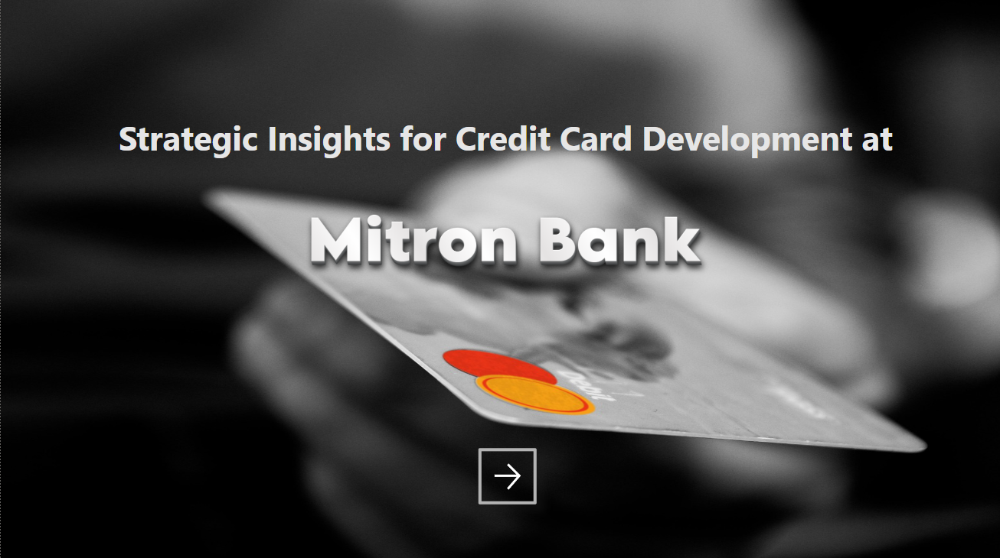
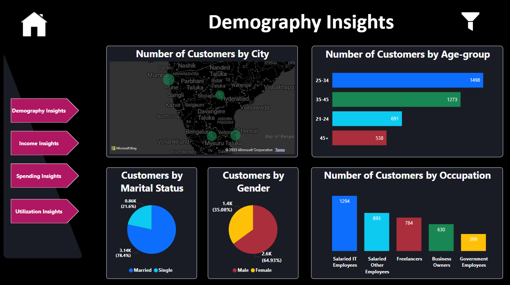
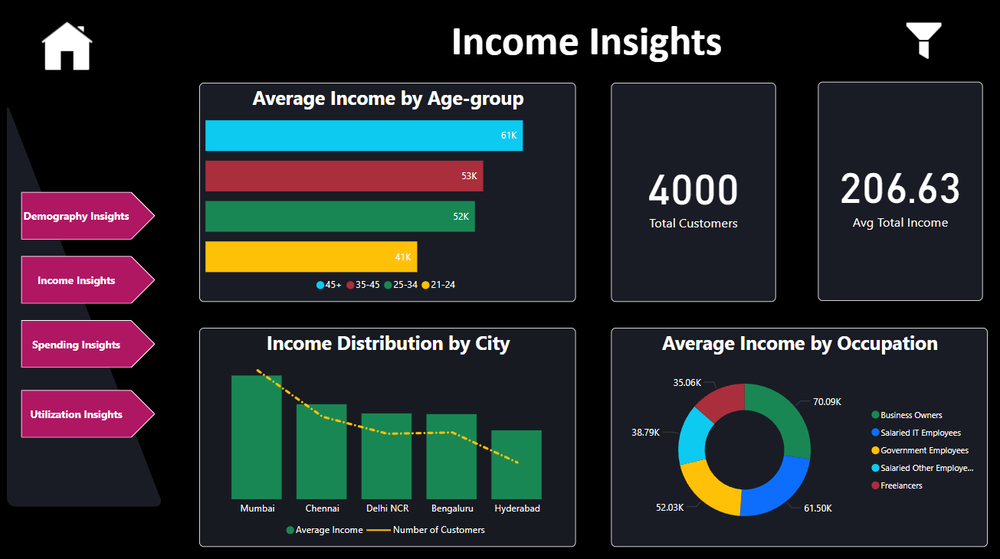
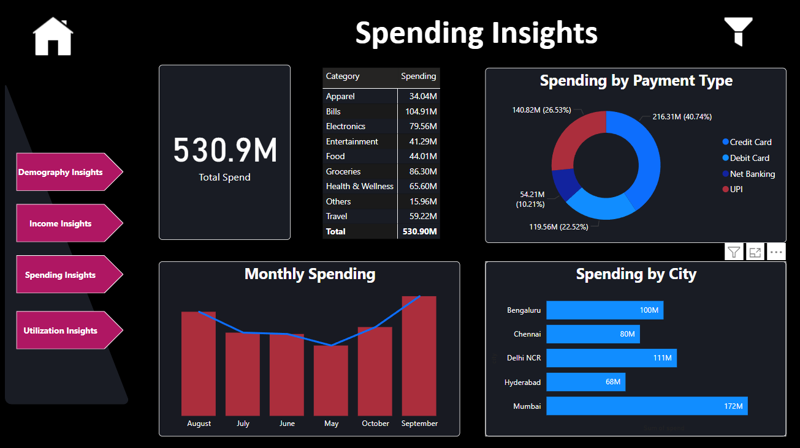
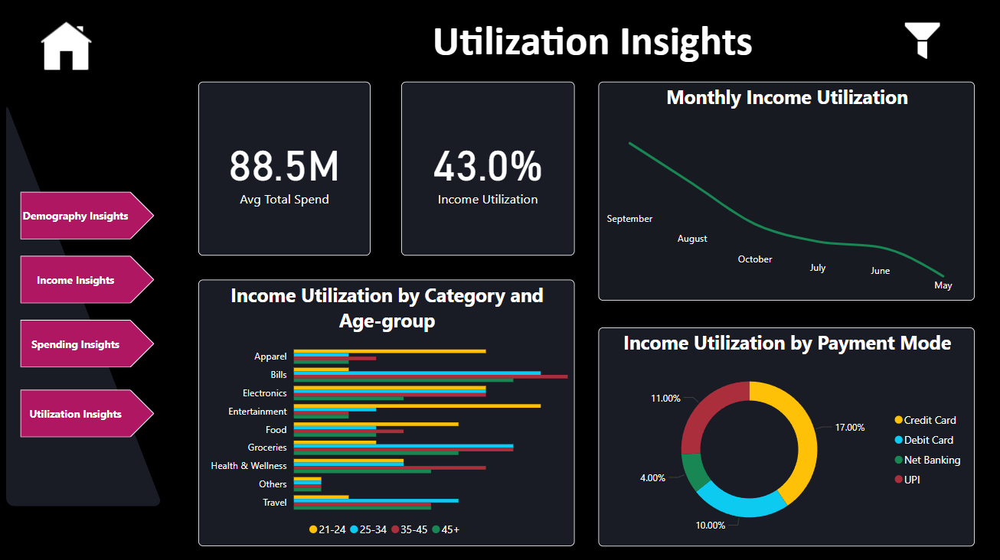

**Power BI Project: Insights for Credit Card Customer Segmentation**

*Overview*

This repository contains the Power BI project file Vis.pbix, developed for Mitron Bank. The project aims to identify the ideal customer segments for their credit card offerings. The report delivers actionable insights across four key areas: Demography, Income, Spending, and Utilization.

*Pages and Features*

1. Demography Insights
Map: Customers by city.
Pie Charts: Distribution of customers by marital status and gender.
Bar Charts: Breakdown of customers by age group and occupation.

2. Income Insights
Bar Chart: Income distribution by city.
Cards: Total customers and average total income.
Ring Chart: Average income by occupation.
Bar Chart: Average income by age group.

3. Spending Insights
Card: Total spend.
Table: Spending by category.
Ring Chart: Spending by payment type.
Bar Charts: Monthly spending and spending by city.

4. Utilization Insights
Cards: Average total spend and income utilization percentage.
Line Chart: Monthly income utilization trend.
Bar Charts: Income utilization by category and age group.
Ring Chart: Income utilization by payment mode.

5. Global Filters
A filter button located at the top-right corner allows users to slice data dynamically using:
Gender
City
Marital Status
Month
Age Group

*Purpose*

This report is designed to help Mitron Bank:

Understand customer profiles to tailor credit card offerings.
Identify spending and income patterns for targeted marketing.
Optimize credit card utilization through data-driven strategies.